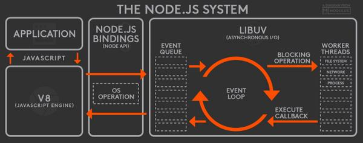
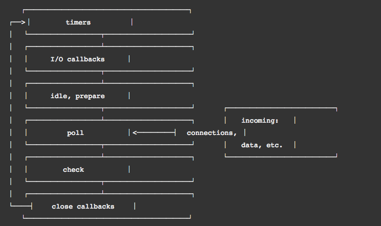

## Node.js简介
Node.js是基于v8引擎的JavaScript运行时，特点是事件驱动，非阻塞，轻量，高效
### Node.js基础架构

> Node.js主要分为三层   
- 最上层是Node.js API 
- 中间层是Node.js Bindings 和 C/C++ Addons，也就是胶水代码  
- 最底层是Node.js依赖的各种库 V8,libuv,http等
  V8是google开源的高性能JavaScript引擎，将JavaScript代码转换成机器码，以C++开发  
  libuv以C语言写的,内部管理着一个线程池，在此基础上提供事件循环Event Loop，异步网络IO,文件系统IO等

## Node.js中的Event Loop

- 一个Node.js应用启动时，V8引擎会执行相关代码，保持一份观察者列表(注册在事件上的回调函数)。
- 当事件发生时，相关的回调函数会添加进一个事件队列。
- 只要这个事件队列中还有等待执行的回调函数，事件循环就会持续把回调函数从队列中拿出并执行。
- 在回调函数执行过程中，所有的I/O请求都会转发给工作线程处理。libuv维持一个线程池，默认包含四个工作线程。
  文件系统IO请求和DNS请求都会放进这个线程池处理,其他的请求，如网络，平台特性请求相关的请求分发给相应的系统处理单元进行处理
- 安排给线程池这些IO操作由Node.js的底层库执行，完成之后触发相应事件
   对应事件回调函数会被添加到事件队列，等待执行后操作      

> 一次事件循环有如下几个阶段   

> 图中分为六个阶段(phase),每个阶段都有自己独有的用于执行回调函数的FIFO队列，当事件循环进入一个指定阶段时，就会执行队列中的回调函数。
> 当队列中回调函数已经被清空或执行回调函数的个数已达最在限制时，事件循环会进入下一个阶段。   
- timers: 该阶段执行由setTimeout()和setInterval()设置的回调函数   
- I/O callbacks： 执行除了 close回调,timers,setImmediate()设置的回调函数以外的几乎所有回调  
- idle,prepare: 仅供内部使用   
- poll： 检索新的I/O事件；在适当的时候Node.js会阻塞等待  
- check: 执行setImmediate()设置的回调   
- close,callbacks: 执行关闭回调，比如socket.on('close',...)    

> poll 阶段的两个功能  
- 当timers到达指定时间后，执行指定的timer的回调    
- 处理poll队列的事件(processing in the poll queue)    

> 当进入到poll阶段，并且没有timers被调用的时候，会发生下面的情况     
- 如果poll队列不为空，Event Loop 将同步的执行poll queue里的callback，直到清空poll queue或执行的callback到达上限     
- 如果poll队列为空，则会发生下面的情况：
    如果调用了setImmediate(),Event Loop将会结束poll阶段并且进入到check阶段执行setImmediate()的回调     
    如果脚本没有被setImmediate()调用，Event Loop将会等待回调被添加到队列中，然后执行它们     
    当进入到poll队列，并且调用了timers的话，会发生下面的情况:
        一旦poll queue队列是空的，Event Loop会检查是否timers，
        如果有一个或多个timers时间已经到达,Event Loop将会回到timers阶段，并
        执行相应的time阶段的callback(进入到下一个事件循环)

>  I/O callbacks与poll区别？   
- I/O callbacks阶段会执行 Pending callbacks，绝大多数情况下，在poll阶段，所有的I/O回调已经被执行。但是在
   I/O callbacks阶段执行的回调函数，是上一次事件循环中被延迟执行的回调函数    

> process.nextTick()产生的回调函数保存在一个叫做 next Tick Queue的队列中,不在6个阶段的任何一个队列中。在当前操作完成后，nextTickQueue中的回调   
> 函数会立即执行，不管事件循环处在哪个阶段，也就是说，在nextTickQueue中的回调函数被执行完毕之前，事件循环不会往下运行。   

> Node.js中宏队列主要有4个    
- 1. Timers Queue   
- 2. IO Callbacks Queue  
- 3. Check Queue   
- 4. Close Callbacks Queue   

> Node.js微队列主要有2个   
- 1. Next Tick Queue: 是放置process.nextTick(callback)的回调任务的   
- 2. Other Micro Queue: 放置其他microtask,比如promise等    

### Node.js Event Loop    
- 1. 执行全局的JavaScript同步代码，将各种异步任务放置相应的异步任务队列中，暂不执行，直到所有同步任务执行完成     
- 2. 执行microtask微任务，先执行next Tick Queue中所有的process.nextTick(),再执行Other Micro Queue中的所有微任务    
- 3. 开始执行macrotask宏任务，共6个阶段,新版本node此处模型和是浏览器一样的，就是执行完每单个宏任务就开始检测执行microtask也就是步骤2   
     在老版本是执行一个阶段的所有的宏任务之后，开始执行microtask任务也就是步骤2     
- 4. 重复步骤3和步骤2直到所有阶段的宏任务清空     

> setTimeout和setImmediate   
- setTimeout在timers阶段执行，并且在poll阶段判断是否达到指定的timer时间才会执行    
- setImmediate在Check阶段执行    
- 如果两者在主模块 main module中调用，那么执行先后取决于进程性能，顺序随机    
- 如果两者都不在主模块调用，即在一IO Circle中调用,那么setImmediate的回调先执行，因为会先到Check阶段    

> setImmediate和process.nextTick   
- setImmediate的回调任务插入到宏队列Check Queue中   
- process.nextTick的回调任务会插入到微队列 Next Tick Queue中    
- process.nextTick调用深度有限制，上限是1000,而setImmediate没有